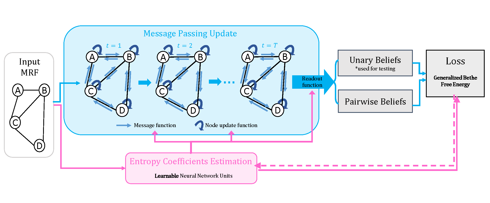

# Theory-guided Message Passing Neural Network for Probabilistic Inference
> Zijun Cui, Hanjing Wang, Tian Gao, Kartik Talamadupula, Qiang Ji (AISTATS 2024)

## Dependencies

Create the environment using the `environment.yml` file

## Datasets

Generate new datasets using the `generate_data_pi_pij.py` file

An example set of dataset is included in the folder `graphical_models`

## Evaluations
The proposed model is evaluated using the `main_evaluation_TMPNN.py` file

The training-free models are evaluated using the `main_evaluation_BP_TRWBP_MPLP.py` file

The trainin-based model is evaluated using the `main_evaluation_GNN.py` file

## Codes are build based on [Node-GNN](https://github.com/ks-korovina/pgm_graph_inference)

## Contact
ceejkl@gmail.com 

